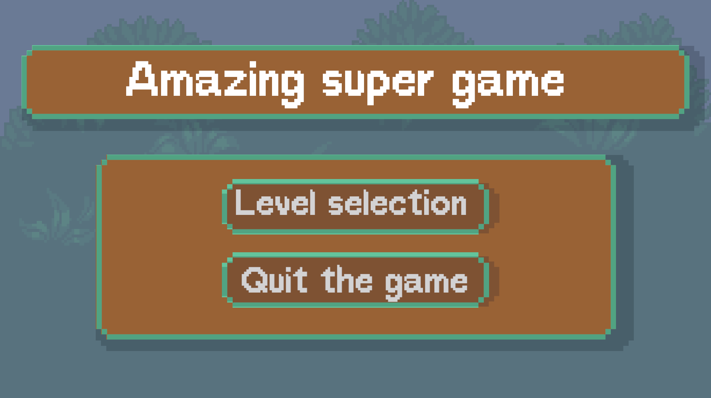
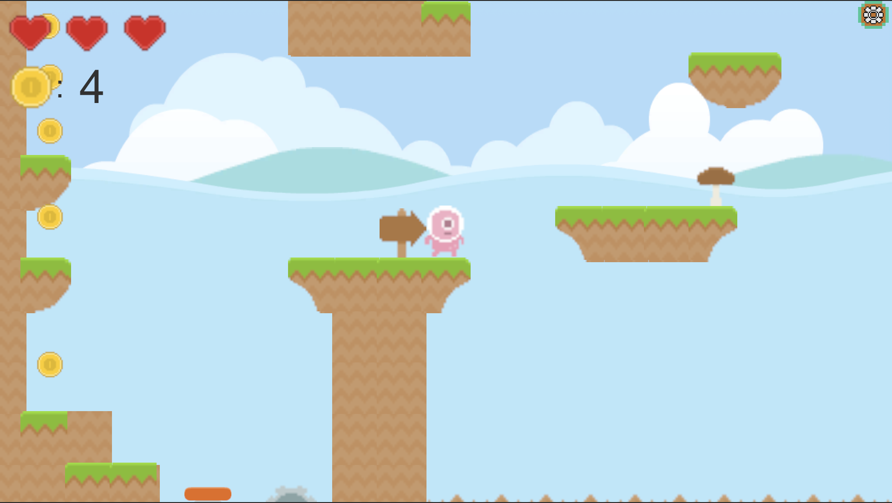
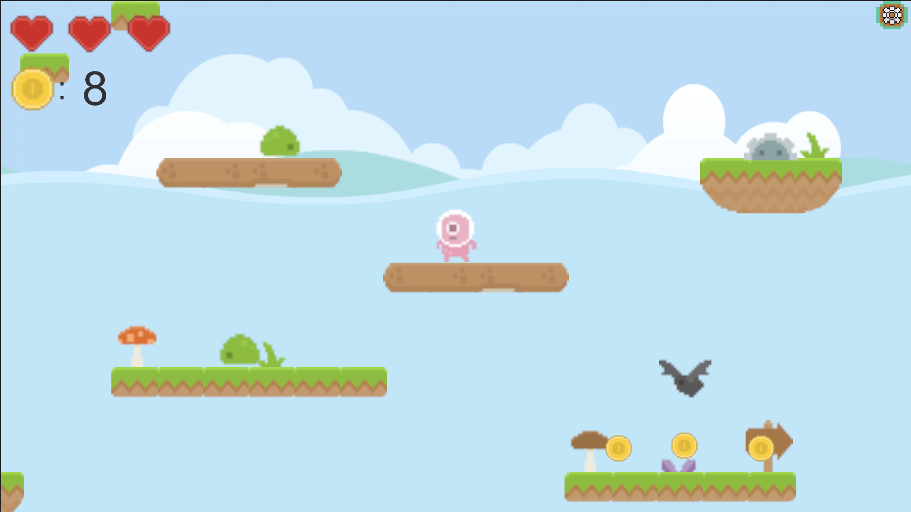

# Amazing Super Game

Добро пожаловать в репозиторий игры-платформера! Это 2D игра, в которой игроку нужно пройти серию уровней, избегая препятствий, побеждая врагов и собирая монетки. 
Проект создан на движке Unity

## Оглавление

- [Скриншоты](#скриншоты)
- [Особенности](#особенности)
- [Требования](#требования)
- [Установка](#установка)
- [Как играть](#как-играть)

## Скриншоты





## Особенности

- **Интуитивное управление:** Простые и отзывчивые механики для увлекательного игрового процесса.
- **Разнообразные уровни:** 5 Увлекательных уровней с уникальными препятствиями и ловушками с нарастанием сложности.

## Требования

- **Unity**: Версия Unity 6 (6000.0.23f1) или выше (рекомендуется).
- **Поддержка платформы**: Игра разрабатывается для ПК, но может быть адаптирована для других платформ (например, Android или iOS) в зависимости от настроек Unity.

## Установка

1. Клонируйте репозиторий на локальный компьютер:
    ```bash
    git clone https://github.com/nadyahse2/GamePlatformer.git
    ```

2. Откройте Unity Hub, выберите **Open** и укажите путь к склонированному проекту.

3. Убедитесь, что выбрана правильная версия Unity. Если версия не совпадает, Unity может предложить обновить или изменить версию проекта.

4. После загрузки проекта в Unity запустите сцену `MainMenu` в папке `Assets/Scenes`.

## Как играть

- **Управление персонажем**:
    - **Влево/Вправо**: Используйте клавиши стрелок или `A` и `D`.
    - **Прыжок**: Нажмите `Пробел` для прыжка.
- **Цель игры**: Пройдите все уровни, избегайте ловушек, не попадайтесь кровожадным монстрам и постарайтесь собрать как можно больше бонусов!
- **Окружении**:
    -Анимированное передвижение персонажа
    -Острые блоки: при падении на которые персонаж умирает
    -Обваливающиеся блоки
    -Пружины: при использовании герой прыгает выше
    -Жизни героя: при прохождении уровня у игрока 3 очка здоровья, если герой потеряет все очки он погибает
    -**Враги**:
      -Статичные монстры: при столкновении с этим видом персонаж умирает
      -Патрулирующий монстр: монстр передвигается, при столкновении с ним теряется очко жизни, герой может его устранить, если прыгнет на него
      -Летающий монстр: монстр может передвигаться по воздуху, при столкновении с ним герой теряет очко жизни
